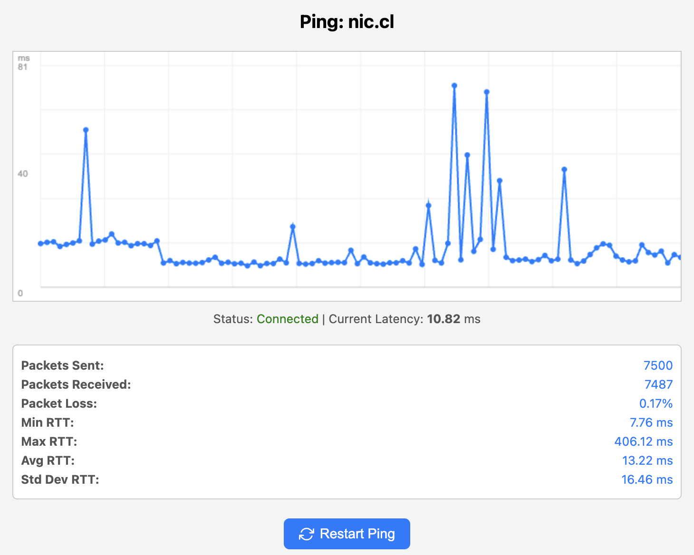

# LivePing

LivePing is a real-time network latency monitoring tool that provides a web-based interface for visualizing ping results. It features a responsive design, real-time graphing, and detailed statistics.




## Features

- Real-time ping visualization with interactive graph
- Web-based interface with responsive design
- Detailed statistics including min/max/avg RTT and packet loss
- Visual indication of lost packets
- Automatic reconnection on disconnection
- Cross-platform support

## Installation

### Using Go

```bash
# Install using go install
go install github.com/rodrigopv/liveping/cmd/liveping@latest

# Or clone and build from source
git clone https://github.com/rodrigopv/liveping.git
cd liveping
go build -o liveping ./cmd/liveping
```

## Usage

Basic usage:
```bash
liveping <target>
```

Options:
```bash
# Specify a custom listen address (default :8080)
liveping -l :9000 <target>

# Set ping interval in milliseconds (default 100ms)
liveping -i 1000 <target>

# Enable verbose output for ping responses
liveping -v <target>

# Show help
liveping -h
```

### Examples

Ping Google's DNS server:
```bash
liveping 8.8.8.8
```

Ping with custom port and interval:
```bash
liveping -l :9000 -i 500 google.com
```

Ping with verbose output:
```bash
liveping -v cloudflare.com
```

## Web Interface

Once started, open your browser and navigate to:
```
http://localhost:8080
```

The web interface provides:
- Real-time latency graph
- Current latency display
- Detailed statistics
- Restart button
- Responsive design for mobile devices

## Building from Source

1. Clone the repository:
```bash
git clone https://github.com/rodrigopv/liveping.git
cd liveping
```

2. Build the binary:
```bash
go build -o liveping ./cmd/liveping
```

3. Run the tool:
```bash
./liveping <target>
```

## Project Structure

```
liveping/
├── cmd/
│   └── liveping/
│       └── main.go
├── internal/
│   └── ping/
│       ├── assets/
│       │   └── index.html
│       ├── assets.go
│       ├── config.go
│       └── server.go
├── go.mod
├── go.sum
├── LICENSE
└── README.md
```

## Contributing

Contributions are welcome! Please feel free to submit a Pull Request.

## License

This project is licensed under the MIT License - see the LICENSE file for details. 
